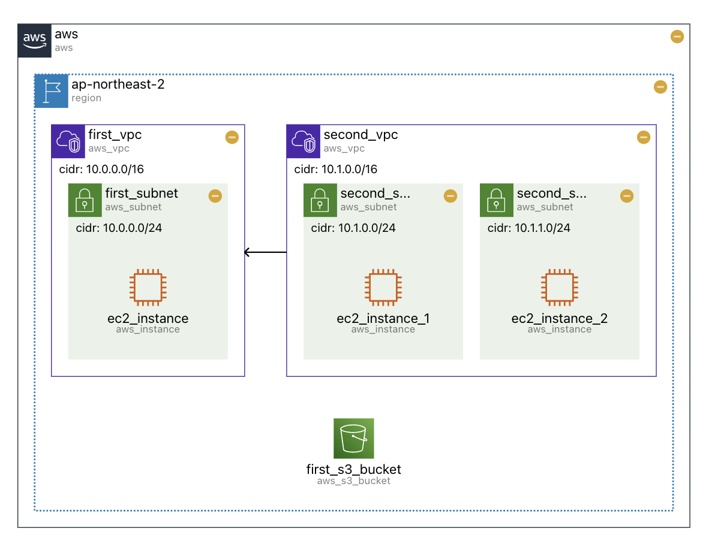
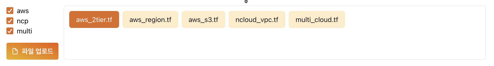
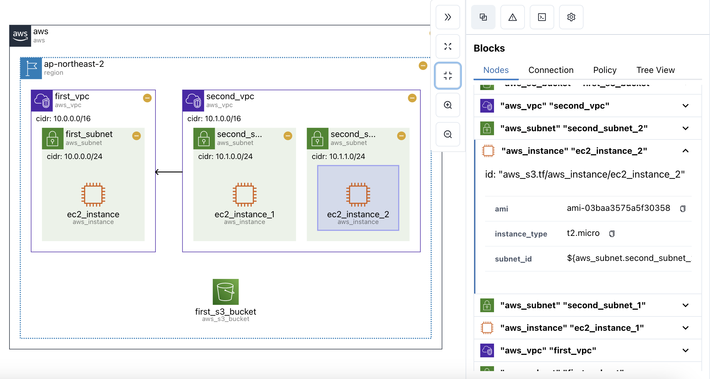

# IaCDOG Dashboard

손쉬운 테라폼 시각화를 위한 대시보드 입니다. 서비스는 [IaCDOG](https://www.sanbo.tech/aww-dashboard)에서 사용해 볼 수 있습니다.



## 서비스 소개

`/aww-dashboard/visualizer` 경로에서 시각화 서비스를 사용할 수 있습니다. 화면 상단의 샘플 코드를 클릭하여 결과물을 보거나, 직접 파일을 업로드하여 빠르게 테스트해볼 수 있습니다.



사이드바에서 시각화 화면과 상호작용하는 다양한 기능 또한 제공하고 있습니다.



## 개발환경 설정

서버를 실제로 실행하여 사용해보고 싶은 경우, 팀 A-wawa의 private npm에 접근해야 합니다. 직접 대시보드와 패키지를 사용해보고 싶으신 분은 `taeinlim02@gmail.com`로 이메일 주시면 private npm에 계정을 만들어 드립니다.

알려드린 주소와 계정으로 npm 로그인을 한 뒤, 홈 디렉터리의 `.npmrc` 내부의 authToken을 .yarnrc.yml에 붙여넣어 주세요.

```bash
yarn

yarn dev # 개발서버 시작
yarn build # 프로덕션 빌드
yarn start # 프로덕션 서버 시작
```
